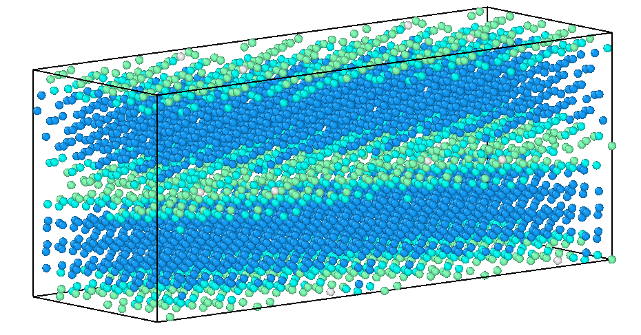

# GB_code
<<<<<<< HEAD
This python package helps you create orthogonal grain boundary supercells for atomistic calculations. The code is based on the coincident site lattice (CSL) formulations for cubic materials (sc, bcc, fcc, diamond). I intend to extend it to hcp structures soon. This code produces a final structure to be read in [LAMMPS](https://lammps.sandia.gov/) or [VASP](https://www.vasp.at/).

# Overview
There are two main scripts: [_csl_generator.py_](./csl_generator.py) and [_gb_generator.py_](./csl_generator.py) which you need to use in this order to produce the final grain boundary (GB) structure.
In this README I will explain the steps to use the code in the Linux Terminal and I have also attached two _jupyter notebooks_ ([Usage_of_GB_code.ipynb](./Usage_of_GB_code.ipynb), [Dichromatic_pattern_CSL.ipynb](./Dichromatic_pattern_CSL.ipynb)) which describe how the code can be accessed and used in the notebooks by various examples. These notebooks have extra functionality. The former is for the general usage of the code with some tips to locate GBs of interest, the latter depicts how CSL construction can be used for different purposes.
You can use [this link](https://mybinder.org/v2/gh/oekosheri/GB_code/master) for an interactive Jupyter notebook environment provided by Binder. [](https://mybinder.org/v2/gh/oekosheri/GB_code/master)
=======
This python package helps you create orthogonal grain boundary supercells for atomistic calculations. The code is based on the coincident site lattice (CSL) formulations for cubic materials (sc, bcc, fcc, diamond). I intend to extend it to hcp structures soon. This code produces a final structure to be read in [LAMMPS](https://lammps.sandia.gov/) or [VASP](https://www.vasp.at/).    

# Overview
There are two main scripts: [_csl_generator.py_](./csl_generator.py) and [_gb_generator.py_](./csl_generator.py) which you need to use in this order to produce the final grain boundary (GB) structure.  
In this README I will explain the steps to use the code in the Linux Terminal and I have also attached two _jupyter notebooks_ ([Usage_of_GB_code.ipynb](./Usage_of_GB_code.ipynb), [Dichromatic_pattern_CSL.ipynb](./Dichromatic_pattern_CSL.ipynb)) which describe how the code can be accessed and used in the notebooks by various examples. These notebooks have extra functionality. The former is for the general usage of the code with some tips to locate GBs of interest, the latter depicts how CSL construction can be used for different purposes.   
You can use [this link](https://mybinder.org/v2/gh/oekosheri/GB_code/master) for an interactive Jupyter notebook environment provided by Binder. [](https://mybinder.org/v2/gh/oekosheri/GB_code/master)   
>>>>>>> 4b7ce212f3029749937e2c1b3693ca0cf3c863dc
To use it locally, you need python3 and numpy1.14 for the main scripts and additionally matplotlib and pandas to use the auxilliary Jupyter notebooks. For installation simply clone or download the code in your terminal.

# Usage
To pick a grain boundary 5 degrees of freedom need to be fixed: rotation axis, rotation angle and GB plane orientation.
We start by choosing only an axis, say a low index [1, 1, 1] and list the possibilities for the angle (sigma). Once you pick
these and additionally a basis, a CSL minimal cell will be created and you can see a list of possible GB plane orientations within
the CSL that you can pick from. In the jupyter notebooks, [Usage_of_GB_code.ipynb](./Usage_of_GB_code.ipynb), example criteria have been
shown to help pinpoint the boundary plane of interest.

The first code [_csl_generator.py_](./csl_generator.py) runs in two modes:

_First mode:
  "python CSLgenerator.py u v w [limit]" ----->  Where the u v w are the
  indices of the rotation axis such as 1 0 0, 1 1 1, 1 1 0 and so on. The limit
  is the maximum Sigma of interest.
  (the limit by default: 100)_

  _ex:_

```
> python csl_generator.py 1 1 1 50

  List of possible CSLs for [1 1 1] axis sorted by Sigma
Sigma:     1  Theta:   0.00
Sigma:     3  Theta:  60.00
Sigma:     7  Theta:  38.21
Sigma:    13  Theta:  27.80
Sigma:    19  Theta:  46.83
Sigma:    21  Theta:  21.79
Sigma:    31  Theta:  17.90
Sigma:    37  Theta:  50.57
Sigma:    39  Theta:  32.20
Sigma:    43  Theta:  15.18
Sigma:    49  Theta:  43.57
```
Once you pick one of these angles (sigma boundaries) you should use the second mode, decide on a basis, for ex: diamond, and list the GB planes of interest:

"
_Second mode:
 "python CSLgenerator.py u v w basis sigma [limit]" -----> Where basis is
  either fcc, bcc, diamond or sc. You read the sigma of interest from the first
  mode run. The limit here refers to CSL GB inclinations. The bigger the limit,
  the higher the indices of CSL planes.
  (the limit by default: 2)_

  _ex:_

```
> python csl_generator.py 1 1 1 diamond 13

----------List of possible CSL planes for Sigma 13---------
 GB1-------------------GB2-------------------Type----------Number of Atoms
[ 2  1 -2]             [ 1  2 -2]             Mixed                  3744
[-1 -1 -1]             [-1 -1 -1]             Twist                  1248
[1 1 1]                [1 1 1]                Twist                  1248
[-1  2 -2]             [-2  2 -1]             Mixed                  3744
[ 1 -2  2]             [ 2 -2  1]             Mixed                  3744
[-2 -1  2]             [-1 -2  2]             Mixed                  3744
[-3 -2  1]             [-2 -3  1]             Mixed                  2912
[ 0 -3  1]             [ 1 -3  0]             Mixed                  2080
[ 1  3 -4]             [-1  4 -3]             Symmetric Tilt         1248
...
```
Which you can write to a file if you wish.

Your chosen axis, basis and sigma will be written to an io_file (a yaml file) which will be read by gb_generator.py.
You must customize the io_file and then run the gb_generator.py code after to get the atomic structure of the GB. This is
how the io_file looks like right now:

```
### input parameters for gb_generator.py ###
# CSL plane of interest that you read from the output of csl_generator as GB1
GB_plane: [1,1,1]
# lattice parameter in Angstrom

lattice_parameter: 4
# atoms that are closer than this fraction of the lattice parameter will be removed
# either from grain1 (g1) or from grain2 (g2). If you choose 0 no atoms will be removed

overlap_distance: 0.3
# decide which grain the atoms should be removed from

which_g: g1
# decide whether you want rigid body translations to be done on the GB_plane or not (yes or no)
# When yes, for any GB aside from twist GBs, the two inplane
# CSL vecs will be divided by integers a and b to produce a*b initial
# configurations. The default values produce 50 initial structures
# if you choose no for rigid_trans, you do not need to care about a and b.
# twist boundaries are handled internally

rigid_trans: no
a: 10
b: 5
# dimensions of the supercell in: [l1,l2,l3],  where l1 isthe direction along the GB_plane normal
#  and l2 and l3 are inplane dimensions

dimensions: [1,1,1]

# The following is your csl_generator output. YOU DO NOT NEED TO CHANGE THEM!

axis: [1, 1, 1]
m: 7
n: 1
basis: diamond

```
- GB_plane: must be chosen from the list that was provided after running the second mode of csl_generator.py. Here for ex: [2,  1, -2].
Change the default plane to your chosen one.
- lattice_parameter: is self-explanatory.

To minimize the grain boundary energy, microscopic degrees of freedom must be taken into account. Therefore here we allow for
(1) atom removal by finding atoms that are too close to one another and (2) rigid body translations on the GB plane.
(1) will be achieved by

- overlap_distance: a fraction of lattice parameter. See the description in io_file.
- which_g: g1 or g2

(2) will be achieved by

-  rigid_trans: yes or no. If no, the following a and b will be disregarded. For any grain boundary type except the twist boundary, the smallest inplane unit that must be scanned comprises the unitcell formed by the smallest orthogonal CSL vectors on the GB plane. These vectors will be divided by the following a and b integers to produce a grid upon which the boundary will be translated. Here a is used for the larger inplane vector and b for the smaller one. So by defalut I produce _5 * 10 = 50_ initial structures to be minimized for finding the lowest energy structure. The higher your chosen a and b, the denser the grid.
For the twist grain boundary the smallest unit that needs to be scanned is the unitcell created by the DSC vectors (the smallest repeat vectors of the CSL) and the code will handle it internally.
- a: 10
- b: 5

You can choose a combination of atom removal and rigid body translation for finding the minimum energy GB.

- dimensions: Finally the supercell dimensions according to the io_file. Make sure you always choose a large enough l1 dimension that the GB and its periodic image do not interact.

As an example, we change the default gb_plane to [2,  1, -2] and rigid_trans to 'yes' in the io_file.
To produce the GB of interest we go on with: [_gb_generator.py_](./gb_generator.py)
```
> python gb_generator.py io_file
<<------ 32 atoms are being removed! ------>>
<<------ 50 GB structures are being created! ------>>
```
The following is one of these 50 GBs visualized by [Ovito](https://ovito.org/index.php/download):
The color code distinguishes the diamond bulk structure as blue. The color changes gradually to green as we approach the GB atoms. In the middle lies the central GB and on both up and bottom of the cell you have halves of an equivalent GB (the periodic image).



- _**A note on the microscopic degrees of freedom:**_

In the absence of a consensus on how to find the global minimum energy GB structure I have used atom removal and/or rigid body translations according to the description above to find the minimized structure. For rigid body translations, the smallest translation vector to guarantee the minimum energy structure is not well defined, therefore you can make the mesh as dense as you wish by choosing larger a and b values. By trial and error in fcc elemental cases (such as Al and Cu) I have come to the rule of thumb conclusion of 50
to 100 initial structures that need to be minimized to find the minimum energy GB.
In the end you must find a crossover between the accuracy you need and the computational cost of running minimization on several
input structures.
If you are a more rigorous user, you can just create the GB structure with no atom removal or rigid body translations and run a more involved minimum energy search routine.

- _**A note on the minimization procedure:**_

I often do a three stage minimization at 0K followed by an MD annealing simulation in [LAMMPS](https://lammps.sandia.gov/).
The 0K miminimization is composed of: A conjugate gradient minimization of the energy of atoms, the simulation box and then atoms again;
similar to a procedure explained [here](https://icme.hpc.msstate.edu/mediawiki/index.php/LAMMPS_Input_Deck_for_Grain_boundary_generation).
For the annealing simulations I use an _nvt_ ensemble followed by damped dynamics. Depending on the GB structure and your final purpose you can run annealing simulations for different time spans.
# Questions

If you have any questions, raise an issue or contact [me](mailto:shahrzadhadian@gmail.com).
Feel free to use the code anyway you like, if you find it useful please cite this page or the attached paper.

# License
[MIT](./LICENSE).
